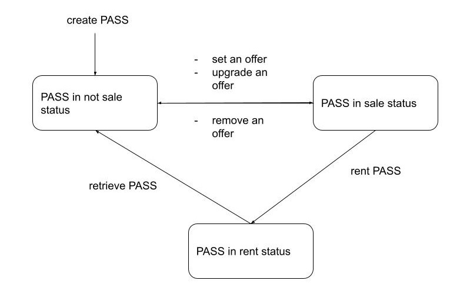

# PASStoken
PASS is an ERC721 token that implements some additional features for renting through the holder and the consumer. The goal is to allow the user to use PASS as an access ticket, a monthly subscription or any other service with an expiry date. On the other hand, the customer can prove that he is the current consumer.

## User cases
 - Football Club can use PASS for representing every seat in stadium
 - Big company can use PASS to allow external collaborators to access a reserved area
 - dApp can use PASS to allow users to view a private section
 - Important brands can use PASS for renting cars or boats 

## How to interact with PASS
PASS inherit to ERC721URIStorage deployed by OpenZeppeling. It also implements these principal functions:

| Name | Description | Permission |
| ------ | ------ | ------ |
| createPass(tokenURI) | create a new PASS token with a tokenURI | all |
| setOffer(tokenId, price, time) | set a new offer for the PASS | owner |
| upgradeOffer(tokenId, price, time)  | upgrade current offer for the PASS | owner |
| removeOffer(tokenId) | remove current offer for the PASS | owner |
| rentPass(tokenId, price, time) | pay to rent the PASS in sale | all (yes also the owner :grin: ) |
| retrievePass(tokenId) | retrieve the PASS to rented to not for sale | owner |
| getDetails(tokenId) | get info about status of PASS | all |
| isConsumer(tokenId) | verify if the caller is the actual consumer of PASS | all |

## Workflow

## The question: PASS makes sense to exist?
In the end of implementation i made some tests and i think that the answer is no. The problem is the cost of gas request for operations.
With Ganache and Kovan network i saw that create new PASS is cheaper than set an offer. So the workflow set offer -> retrieve pass -> ...again is very expansive for the owner. Also the benefits for the consumer are very few, in fact renting PASS costs almost equal as minting. I think that to resolve previous use cases is a better solution minting a new token directly every time. 

## Conclusion
With this project i was able to touch the difference between writing smart contratcs that perform in a blockchain ecosystem and non. Software that does not run on blockchain can be written in many ways but always do the usual job. With the hardware power of now doing an extra loop in an array is definitely not a problem the user can detect. Different is the case of smart contracts, where a bad implementation can make it unusable even if its outputs are correct.

## Demo
I create simple dApp to interact whit PASS token avaiable on https://petalite-hulking-kookaburra.glitch.me/. Please connect your wallet to the Kovan Network.

## Tools and library
 - Truffle
 - Ganache
 - OpenZeppelin
 - Web3JS (I don't use Drizzle for a issue with solc version ^6.0.0) 
 - ReactJS
 
